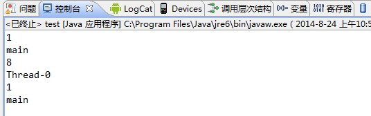

## **个人总结**

​	实现每一个线程都有自己的共享变量

​	ThreadLocal为变量在每个线程中都创建了一个副本，那么每个线程可以访问自己内部的副本变量。 

​	首先，**在每个线程Thread内部有一个ThreadLocal.ThreadLocalMap类型的成员变量threadLocals**，这个threadLocals就是用来存储实际的变量副本的，键值为当前ThreadLocal变量，value为变量副本（即T类型的变量）。

　　初始时，在Thread里面，threadLocals为空，当通过ThreadLocal变量调用get()方法或者set()方法，就会对Thread类中的threadLocals进行初始化，并且以当前ThreadLocal变量为键值，以ThreadLocal要保存的副本变量为value，存到threadLocals。

- 实际的通过ThreadLocal创建的副本是存储在每个线程自己的threadLocals中的；
- 为何threadLocals的类型ThreadLocalMap的键值为ThreadLocal对象，因为每个线程中可有多个threadLocal变量，就像上面代码中的longLocal和stringLocal；
- 进行get之前，必须先set，否则会报空指针异常；如果想在get之前不需要调用set就能正常访问的话，必须重写initialValue()方法。

## 别处摘录 ThreadLocal原理：

**Thread**.ThreadLocalMap<**ThreadLocal**, **Object**>;

1、**Thread: 当前线程，可以通过Thread.currentThread()获取。**

2、**ThreadLocal：我们的static ThreadLocal变量。**

3、**Object: 当前线程共享变量。**

我们调用ThreadLocal.get方法时，实际上是从当前线程中获取ThreadLocalMap<**ThreadLocal**, **Object**>，然后根据当前ThreadLocal获取当前线程共享变量**Object。**

ThreadLocal.set，ThreadLocal.remove实际上是同样的道理。

 

#### 这种存储结构的好处：

1、线程死去的时候，线程共享变量ThreadLocalMap则销毁。

2、ThreadLocalMap<ThreadLocal,Object>键值对数量为ThreadLocal的数量，一般来说ThreadLocal数量很少，相比在ThreadLocal中用Map<Thread, Object>键值对存储线程共享变量（Thread数量一般来说比ThreadLocal数量多），性能提高很多。

 

关于ThreadLocalMap<**ThreadLocal**, **Object**>弱引用问题：

当线程没有结束，但是ThreadLocal已经被回收，则可能导致线程中存在ThreadLocalMap<**null**, **Object**>的键值对，造成内存泄露。（ThreadLocal被回收，ThreadLocal关联的线程共享变量还存在）。

虽然ThreadLocal的get，set方法可以清除ThreadLocalMap中key为null的value，但是get，set方法在内存泄露后并不会必然调用，所以为了防止此类情况的出现，我们有两种手段。

1、使用完线程共享变量后，显示调用ThreadLocalMap.remove方法清除线程共享变量；

2、JDK建议ThreadLocal定义为private static，这样ThreadLocal的弱引用问题则不存在了。

  

#### Java并发编程：深入剖析ThreadLocal

 　　下文来自<http://www.cnblogs.com/dolphin0520/p/3920407.html>

### 一.对ThreadLocal的理解

　　ThreadLocal，很多地方叫做线程本地变量，也有些地方叫做线程本地存储，其实意思差不多。可能很多朋友都知道ThreadLocal为变量在每个线程中都创建了一个副本，那么每个线程可以访问自己内部的副本变量。

　　这句话从字面上看起来很容易理解，但是真正理解并不是那么容易。

　　我们还是先来看一个例子：

 　　假设有这样一个数据库链接管理类，这段代码在单线程中使用是没有任何问题的，但是如果在多线程中使用呢？很显然，在多线程中使用会存在线程安全问题：第一，这里面的2个方法都没有进行同步，很可能在openConnection方法中会多次创建connect；第二，由于connect是共享变量，那么必然在调用connect的地方需要使用到同步来保障线程安全，因为很可能一个线程在使用connect进行数据库操作，而另外一个线程调用closeConnection关闭链接。

　　所以出于线程安全的考虑，必须将这段代码的两个方法进行同步处理，并且在调用connect的地方需要进行同步处理。

　　这样将会大大影响程序执行效率，因为一个线程在使用connect进行数据库操作的时候，其他线程只有等待。

　　那么大家来仔细分析一下这个问题，这地方到底需不需要将connect变量进行共享？事实上，是不需要的。假如每个线程中都有一个connect变量，各个线程之间对connect变量的访问实际上是没有依赖关系的，即一个线程不需要关心其他线程是否对这个connect进行了修改的。

　　到这里，可能会有朋友想到，既然不需要在线程之间共享这个变量，可以直接这样处理，在每个需要使用数据库连接的方法中具体使用时才创建数据库链接，然后在方法调用完毕再释放这个连接。比如下面这样：

 　　这样处理确实也没有任何问题，由于每次都是在方法内部创建的连接，那么线程之间自然不存在线程安全问题。但是这样会有一个致命的影响：导致服务器压力非常大，并且严重影响程序执行性能。由于在方法中需要频繁地开启和关闭数据库连接，这样不尽严重影响程序执行效率，还可能导致服务器压力巨大。

　　那么这种情况下使用ThreadLocal是再适合不过的了，因为ThreadLocal在每个线程中对该变量会创建一个副本，即每个线程内部都会有一个该变量，且在线程内部任何地方都可以使用，线程之间互不影响，这样一来就不存在线程安全问题，也不会严重影响程序执行性能。

　　但是要注意，虽然ThreadLocal能够解决上面说的问题，但是由于在每个线程中都创建了副本，所以要考虑它对资源的消耗，比如内存的占用会比不使用ThreadLocal要大。

### 二.深入解析ThreadLocal类

　　在上面谈到了对ThreadLocal的一些理解，那我们下面来看一下具体ThreadLocal是如何实现的。

　　先了解一下ThreadLocal类提供的几个方法：

 　　get()方法是用来获取ThreadLocal在当前线程中保存的变量副本，set()用来设置当前线程中变量的副本，remove()用来移除当前线程中变量的副本，initialValue()是一个protected方法，一般是用来在使用时进行重写的，它是一个延迟加载方法，下面会详细说明。

　　首先我们来看一下ThreadLocal类是如何为每个线程创建一个变量的副本的。

　　先看下get方法的实现：

　　

 　　第一句是取得当前线程，然后通过getMap(t)方法获取到一个map，map的类型为ThreadLocalMap。然后接着下面获取到<key,value>键值对，注意这里获取键值对传进去的是  this，而不是当前线程t。

　　如果获取成功，则返回value值。

　　如果map为空，则调用setInitialValue方法返回value。

　　我们上面的每一句来仔细分析：

　　首先看一下getMap方法中做了什么：

　　

　　可能大家没有想到的是，在getMap中，是调用当期线程t，返回当前线程t中的一个成员变量threadLocals。

　　那么我们继续取Thread类中取看一下成员变量threadLocals是什么：

　　

　　实际上就是一个ThreadLocalMap，这个类型是ThreadLocal类的一个内部类，我们继续取看ThreadLocalMap的实现：

　　

　　可以看到ThreadLocalMap的Entry继承了WeakReference，并且使用ThreadLocal作为键值。

　　然后再继续看setInitialValue方法的具体实现：

　　很容易了解，就是如果map不为空，就设置键值对，为空，再创建Map，看一下createMap的实现：

　　

　　至此，可能大部分朋友已经明白了ThreadLocal是如何为每个线程创建变量的副本的：

　　首先，在每个线程Thread内部有一个ThreadLocal.ThreadLocalMap类型的成员变量threadLocals，这个threadLocals就是用来存储实际的变量副本的，键值为当前ThreadLocal变量，value为变量副本（即T类型的变量）。

　　初始时，在Thread里面，threadLocals为空，当通过ThreadLocal变量调用get()方法或者set()方法，就会对Thread类中的threadLocals进行初始化，并且以当前ThreadLocal变量为键值，以ThreadLocal要保存的副本变量为value，存到threadLocals。

　　然后在当前线程里面，如果要使用副本变量，就可以通过get方法在threadLocals里面查找。

　　下面通过一个例子来证明通过ThreadLocal能达到在每个线程中创建变量副本的效果：

 　　这段代码的输出结果为：

　　

　　从这段代码的输出结果可以看出，在main线程中和thread1线程中，longLocal保存的副本值和stringLocal保存的副本值都不一样。最后一次在main线程再次打印副本值是为了证明在main线程中和thread1线程中的副本值确实是不同的。

　　总结一下：

　　1）实际的通过ThreadLocal创建的副本是存储在每个线程自己的threadLocals中的；

　　2）为何threadLocals的类型ThreadLocalMap的键值为ThreadLocal对象，因为每个线程中可有多个threadLocal变量，就像上面代码中的longLocal和stringLocal；

　　3）在进行get之前，必须先set，否则会报空指针异常；

　　    如果想在get之前不需要调用set就能正常访问的话，必须重写initialValue()方法。

　　　 因为在上面的代码分析过程中，我们发现如果没有先set的话，即在map中查找不到对应的存储，则会通过调用setInitialValue方法返回i，而在setInitialValue方法中，有一个语句是T value = initialValue()， 而默认情况下，initialValue方法返回的是null。

　　

　　看下面这个例子：

　　

 　　在main线程中，没有先set，直接get的话，运行时会报空指针异常。

　　但是如果改成下面这段代码，即重写了initialValue方法：

 　　就可以直接不用先set而直接调用get了。

### 三.ThreadLocal的应用场景

　　最常见的ThreadLocal使用场景为 用来解决 数据库连接、Session管理等。

　　如：

 　　下面这段代码摘自：

　　<http://www.iteye.com/topic/103804>