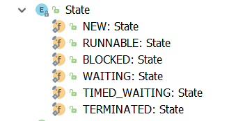
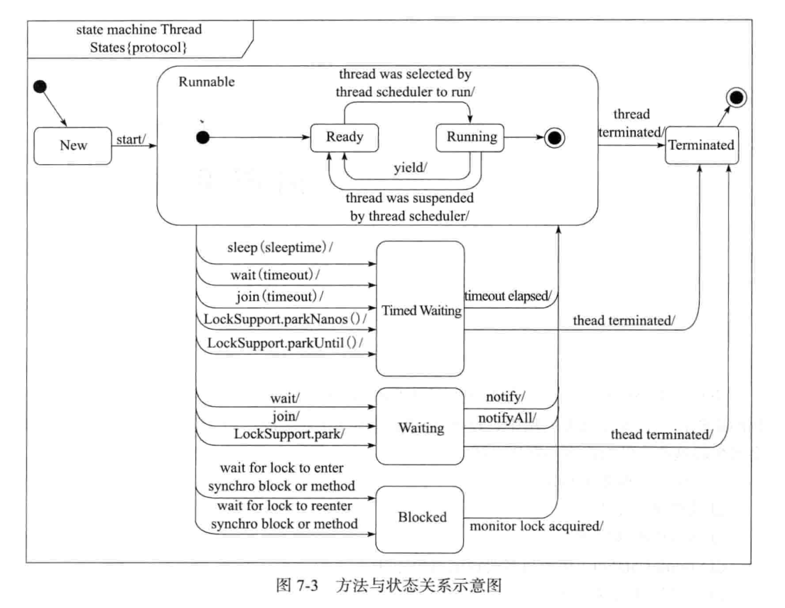

Thread.state
```java
NEW,   // 尚未启动的线程 线程刚新建好
RUNNABLE, // 正在java虚拟机中执行的线程 线程正在跑run方法
BLOCKED, // 受诸塞并等待某个监视器锁的线程处于这种状态  就是等待其他线程释放锁 
WAITING, // 无限制的等待另一个线程来执行某一特定操作的线程处于这种状态 执行waiting()方法
TIMED_WAITING, // 等待另一个线程来执行取决于指定等待时间的操作的线程处于这种状态 执行waiting（long）方法
TERMINATED; // 已退出的线程处于这种状态
```

