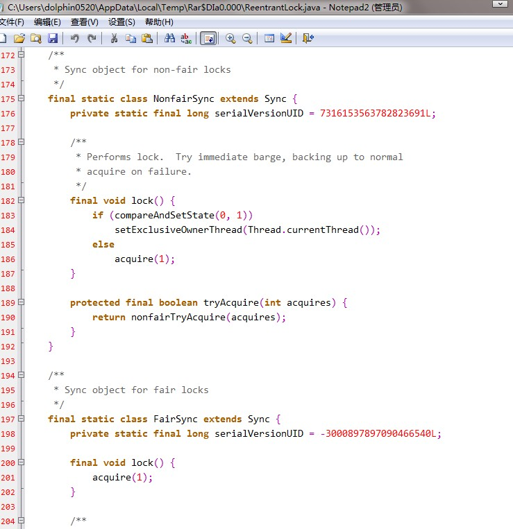
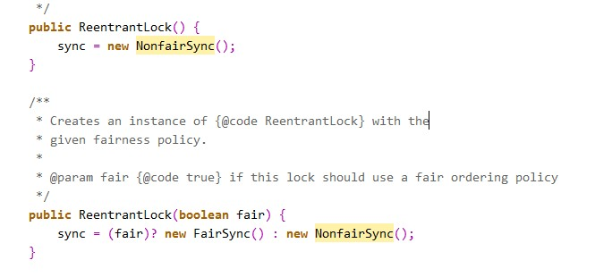

#### 部分参考自 http://www.cnblogs.com/dolphin0520/p/3923167.html


## 锁清除

编译器会清除一些使用了同步，但同步块中没有涉及共享数据的锁，从而减少多余的同步。

## 锁粗化

若有一系列操作，反复地对同一把锁进行上锁和解锁操作，编译器会扩大这部分代码的同步块的边界，从而只使用一次上锁和解锁操作。 

 

# 锁类别一

## 自旋锁

- 背景：互斥同步对性能最大的影响是阻塞，挂起和恢复线程都需要转入内核态中完成；并且通常情况下，共享数据的锁定状态只持续很短的一段时间，为了这很短的一段时间进行上下文切换并不值得。
- 原理：当一条线程需要请求一把已经被占用的锁时，并不会进入阻塞状态，而是继续持有CPU执行权等待一段时间，该过程称为『自旋』。
- 优点：由于自旋等待锁的过程线程并不会引起上下文切换，因此比较高效；
- 缺点：自旋等待过程线程一直占用CPU执行权但不处理任何任务，因此若该过程过长，那就会造成CPU资源的浪费。
- 自适应自旋：自适应自旋可以根据以往自旋等待时间的经验，计算出一个较为合理的本次自旋等待时间。


## 轻量级锁

- 本质：使用CAS取代互斥同步。
- 背景：『轻量级锁』是相对于『重量级锁』而言的，而重量级锁就是传统的锁。
- 轻量级锁与重量级锁的比较：  
- - 重量级锁是一种悲观锁，它认为总是有多条线程要竞争锁，所以它每次处理共享数据时，不管当前系统中是否真的有线程在竞争锁，它都会使用互斥同步来保证线程的安全；
  - 而轻量级锁是一种乐观锁，它认为锁存在竞争的概率比较小，所以它不使用互斥同步，而是使用CAS操作来获得锁，这样能减少互斥同步所使用的『互斥量』带来的性能开销。
- 实现原理：  
- - 对象头称为『Mark Word』，虚拟机为了节约对象的存储空间，对象处于不同的状态下，Mark Word中存储的信息也所有不同。
  - Mark Word中有个标志位用来表示当前对象所处的状态。
  - 当线程请求锁时，若该锁对象的Mark Word中标志位为01（未锁定状态），则在该线程的栈帧中创建一块名为『锁记录』的空间，然后将锁对象的Mark Word拷贝至该空间；最后通过CAS操作将锁对象的Mark Word指向该锁记录；
  - 若CAS操作成功，则轻量级锁的上锁过程成功；
  - 若CAS操作失败，再判断当前线程是否已经持有了该轻量级锁；若已经持有，则直接进入同步块；若尚未持有，则表示该锁已经被其他线程占用，此时轻量级锁就要膨胀成重量级锁。
- 前提：轻量级锁比重量级锁性能更高的前提是，在轻量级锁被占用的整个同步周期内，不存在其他线程的竞争。若在该过程中一旦有其他线程竞争，那么就会膨胀成重量级锁，从而除了使用互斥量以外，还额外发生了CAS操作，因此更慢！

## 偏向锁

- 作用：偏向锁是为了消除无竞争情况下的同步原语，进一步提升程序性能。
- 与轻量级锁的区别：轻量级锁是在无竞争的情况下使用CAS操作来代替互斥量的使用，从而实现同步；而偏向锁是在无竞争的情况下完全取消同步。
- 与轻量级锁的相同点：它们都是乐观锁，都认为同步期间不会有其他线程竞争锁。
- 原理：当线程请求到锁对象后，将锁对象的状态标志位改为01，即偏向模式。然后使用CAS操作将线程的ID记录在锁对象的Mark Word中。以后该线程可以直接进入同步块，连CAS操作都不需要。但是，一旦有第二条线程需要竞争锁，那么偏向模式立即结束，进入轻量级锁的状态。
- 优点：偏向锁可以提高有同步但没有竞争的程序性能。但是如果锁对象时常被多条线程竞争，那偏向锁就是多余的。
- 偏向锁可以通过虚拟机的参数来控制它是否开启。


# 锁类别二

## 1.可重入锁

　　如果锁具备可重入性，则称作为可重入锁。像synchronized和ReentrantLock都是可重入锁，可重入性在我看来实际上表明了锁的分配机制：基于线程的分配，而不是基于方法调用的分配。举个简单的例子，当一个线程执行到某个synchronized方法时，比如说method1，而在method1中会调用另外一个synchronized方法method2，此时线程不必重新去申请锁，而是可以直接执行方法method2。

　　看下面这段代码就明白了：

```java
class MyClass {
    public synchronized void method1() {
        method2();
    }
     
    public synchronized void method2() {
         
    }
}
```

 　　上述代码中的两个方法method1和method2都用synchronized修饰了，假如某一时刻，线程A执行到了method1，此时线程A获取了这个对象的锁，而由于method2也是synchronized方法，假如synchronized不具备可重入性，此时线程A需要重新申请锁。但是这就会造成一个问题，因为线程A已经持有了该对象的锁，而又在申请获取该对象的锁，这样就会线程A一直等待永远不会获取到的锁。

　　而由于synchronized和Lock都具备可重入性，所以不会发生上述现象。

## **2.可中断锁**

　　可中断锁：顾名思义，就是可以相应中断的锁。

　　在Java中，synchronized就不是可中断锁，而Lock是可中断锁。

　　如果某一线程A正在执行锁中的代码，另一线程B正在等待获取该锁，可能由于等待时间过长，线程B不想等待了，想先处理其他事情，我们可以让它中断自己或者在别的线程中中断它，这种就是可中断锁。

　　在前面演示lockInterruptibly()的用法时已经体现了Lock的可中断性。

## **3.公平锁**

　　公平锁即尽量以请求锁的顺序来获取锁。比如同是有多个线程在等待一个锁，当这个锁被释放时，等待时间最久的线程（最先请求的线程）会获得该所，这种就是公平锁。

　　非公平锁即无法保证锁的获取是按照请求锁的顺序进行的。这样就可能导致某个或者一些线程永远获取不到锁。

　　在Java中，synchronized就是非公平锁，它无法保证等待的线程获取锁的顺序。

　　而对于ReentrantLock和ReentrantReadWriteLock，它默认情况下是非公平锁，但是可以设置为公平锁。

　　看一下这2个类的源代码就清楚了：

　　

　　在ReentrantLock中定义了2个静态内部类，一个是NotFairSync，一个是FairSync，分别用来实现非公平锁和公平锁。

　　我们可以在创建ReentrantLock对象时，通过以下方式来设置锁的公平性：

 　　如果参数为true表示为公平锁，为fasle为非公平锁。默认情况下，如果使用无参构造器，则是非公平锁。

　　

　　另外在ReentrantLock类中定义了很多方法，比如：

　　isFair()        //判断锁是否是公平锁

　　isLocked()    //判断锁是否被任何线程获取了

　　isHeldByCurrentThread()   //判断锁是否被当前线程获取了

　　hasQueuedThreads()   //判断是否有线程在等待该锁

　　在ReentrantReadWriteLock中也有类似的方法，同样也可以设置为公平锁和非公平锁。不过要记住，ReentrantReadWriteLock并未实现Lock接口，它实现的是ReadWriteLock接口。

## **4.读写锁**

　　读写锁将对一个资源（比如文件）的访问分成了2个锁，一个读锁和一个写锁。

　　正因为有了读写锁，才使得多个线程之间的读操作不会发生冲突。

　　ReadWriteLock就是读写锁，它是一个接口，ReentrantReadWriteLock实现了这个接口。

　　可以通过readLock()获取读锁，通过writeLock()获取写锁。

　　上面已经演示过了读写锁的使用方法，在此不再赘述。